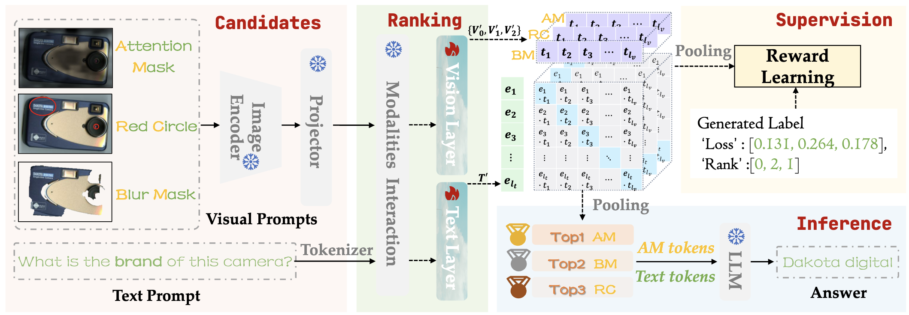
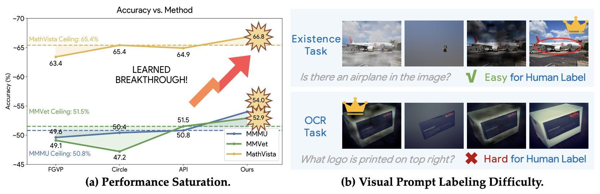

<div align="center">

<h1>AutoV: Loss-Oriented Ranking for Visual Prompt Retrieval in LVLMs</h1>

<h5>

[Yuan Zhang](https://gumpest.github.io/)<sup>1,2</sup>,
[Chun-Kai Fan](https://scholar.google.com/citations?user=TxeAbWkAAAAJ&hl=en&oi=ao)<sup>1</sup>,
[Sicheng Yu](https://openreview.net/profile?id=%7ESicheng_Yu2)<sup>2</sup>,
[Junwen Pan](https://openreview.net/profile?id=~Junwen_Pan1)<sup>2</sup>,
[Tao Huang](https://taohuang.info/)<sup>3</sup>,
[Ming Lu](https://openreview.net/profile?id=~Ming_Lu2)<sup>1</sup>,
[Kuan Cheng](https://cfcs.pku.edu.cn/people/faculty/kuancheng/index.htm)<sup>1</sup>,
[Qi She](https://openreview.net/profile?id=~Qi_She1)<sup>2</sup>,
[Shanghang Zhang](https://idm.pku.edu.cn/info/1017/1598.htm)<sup>1✉️</sup>

<sup>1</sup>School of Computer Science, Peking University<br>
<sup>2</sup>ByteDance Inc. · <sup>3</sup>Shanghai Jiao Tong University

[](https://arxiv.org/pdf/2506.16112)
[](https://github.com/Gumpest/AutoV)
[](https://huggingface.co/datasets/Gumpest/AutoV-data)

</h5>
</div>

## News

- 🔥 **2026-09-01:** Code and data are released.
- 🔥 **2025-09-07:** AutoV is accepted by **ECCV 2026**.

<p align="center">
  
</p>

## Overview

Motivation of AutoV. (a) **Performance saturation**. Existing visual prompts approach benchmark ceilings, limiting further gains from prompt engineering. (b) **Labeling difficulty and task diversity**. Optimal prompts vary across tasks, and the crown denotes the one leading to the correct answer. While the optimal prompt is easy to identify in the top example, it is much harder to determine in the bottom one.

<p align="center">
  
</p>

## Installation

```bash
git clone https://github.com/Gumpest/AutoV.git
cd AutoV

conda create -n autov python=3.10 -y
conda activate autov

cd LLaVA
python -m pip install --upgrade pip
python -m pip install -e ".[train]"
python -m pip install flash-attn==2.3.3 --no-build-isolation
python -m pip install --upgrade huggingface_hub
cd ..
```

## Data

The public dataset is hosted at
[`Gumpest/AutoV-data`](https://huggingface.co/datasets/Gumpest/AutoV-data).
Its top-level directories have distinct roles:

| Path | Role |
| --- | --- |
| `archives/` and `metadata/` | Training data |
| `inference-data/mmvet/` | Inference data |

### Training data

Download the 100K reward annotations and the 20 attention-map archives from
the repository root:

```bash
hf download Gumpest/AutoV-data \
  metadata/llava_v1_5_mix100k_reward.json \
  --repo-type dataset \
  --local-dir ./autov-data

hf download Gumpest/AutoV-data \
  --repo-type dataset \
  --include "archives/attnmap100K/*.tar" \
  --local-dir ./autov-data

mkdir -p data/attnmap100K
cp autov-data/metadata/llava_v1_5_mix100k_reward.json data/
for archive in autov-data/archives/attnmap100K/*.tar; do
  tar -xf "$archive" -C data/attnmap100K
done
```

### Demo Inference data

Download only the demo inference data from the repository root:

```bash
hf download Gumpest/AutoV-data \
  --repo-type dataset \
  --include "inference-data/mmvet/**" \
  --local-dir ./autov-data

mkdir -p LLaVA/playground/data/api_eval/mmvet
cp -a autov-data/inference-data/mmvet/. \
  LLaVA/playground/data/api_eval/mmvet/
```

The resulting directory must contain these four subdirectories:

```text
LLaVA/playground/data/api_eval/mmvet/
├── APICLIP_mmvet_ViT-L-14-336_15/
├── APICLIP_mmvet_ViT-L-14-336_20/
├── APICLIP_mmvet_ViT-L-14-336_22/
└── APICLIP_mmvet_ViT-L-14-336_23/
```

## Training

Run it from the `LLaVA` directory:

```bash
cd LLaVA
bash scripts/v1_5/AutoV_train.sh
```

The script reads:

- Annotations: `../data/llava_v1_5_mix100k_reward.json`
- Attention maps: `../data/attnmap100K`
- Base model: `./checkpoints/llava-v1.5-7b`
- Vision tower: `./checkpoints/clip-vit-large-patch14-336`

Training outputs are written to:

```text
LLaVA/checkpoints/autov_llava-v1.5-7b-reward-100k/
```

### Released checkpoint layout

Place the trained AutoV checkpoint at:

```text
LLaVA/checkpoints/llava-v1.5-7b-reward-100k/
├── config.json
├── model.safetensors.index.json
├── model-*.safetensors
├── tokenizer.model
└── selector_23000steps.pth
```

The AutoV checkpoint is not included in the dataset repository; provide it
locally using the layout above.

## Demo Inference

### 1. Prepare the official MMVet questions

Download the official
[`mm-vet.zip`](https://github.com/yuweihao/MM-Vet/releases/download/v1/mm-vet.zip)
and extract it under `LLaVA/playground/data/eval/`:

### 2. Run AutoV

Run the command from the `LLaVA` directory so that all relative checkpoint and
data paths resolve correctly:

```bash
cd LLaVA
bash scripts/v1_5/eval/autov_mmvet.sh
```

The script uses one GPU by default and writes:

- Raw answers: `playground/data/eval/mm-vet/answers/llava-v1.5-7b-reward-100k.jsonl`
- MMVet submission: `playground/data/eval/mm-vet/results/llava-v1.5-7b-reward-100k.json`

Evaluate the converted JSON with the official
[`MM-Vet`](https://github.com/yuweihao/MM-Vet) evaluation procedure.

## Citation

If you find AutoV useful, please cite:

```bibtex
@inproceedings{zhang2026autov,
  title     = {{AutoV}: Loss-Oriented Ranking for Visual Prompt Retrieval in {LVLMs}},
  author    = {Zhang, Yuan and Fan, Chun-Kai and Yu, Sicheng and Pan, Junwen and Huang, Tao and Lu, Ming and Cheng, Kuan and She, Qi and Zhang, Shanghang},
  booktitle = {European Conference on Computer Vision},
  year      = {2026}
}
```

## License

The AutoV code is released under the [MIT License](LICENSE). The bundled LLaVA
code and external datasets/checkpoints remain subject to their respective
licenses and terms.

## Acknowledgments

We thank the open-source projects
[Attention Prompting on Image](https://github.com/yu-rp/apiprompting),
[LLaVA](https://github.com/haotian-liu/LLaVA), and
[Frame-Voyager](https://openreview.net/forum?id=LNL7zKvm7e).
